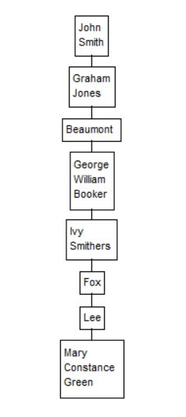

Here's a fun challenge using Turtle graphics (or any GUI of your choice).
Given this list of names, display all the names on the screen each in a
box of size appropriate to the name. Multi-part names are to occupy one
line per part within the box.

```python
data = [
    "John Smith",
    "Graham Jones",
    "Beaumont",
    "George William Booker",
    "Ivy Smithers",
    "Fox",
    "Lee",
    "Mary Constance Green",
]
```

Then, for bonus points, draw lines to join the boxes



---
Author: Mike Kerry

Link: https://www.facebook.com/groups/python/permalink/1361254434715117/